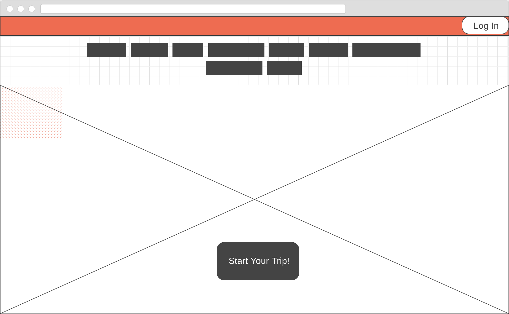
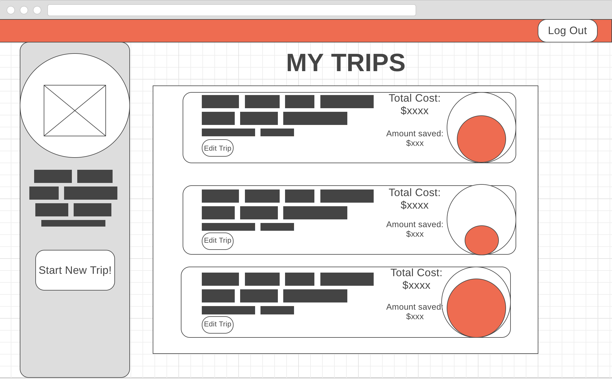
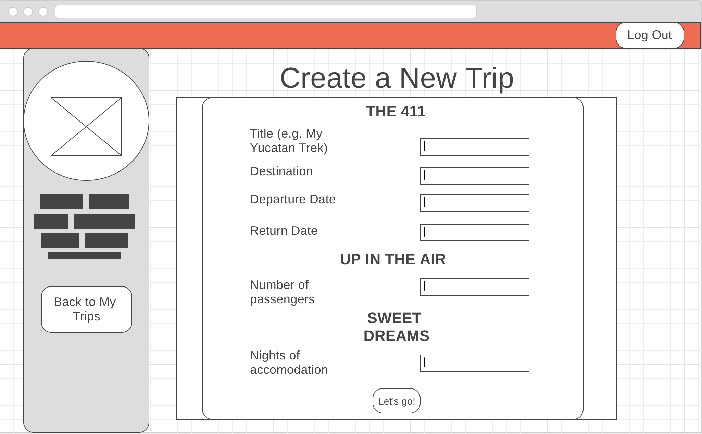
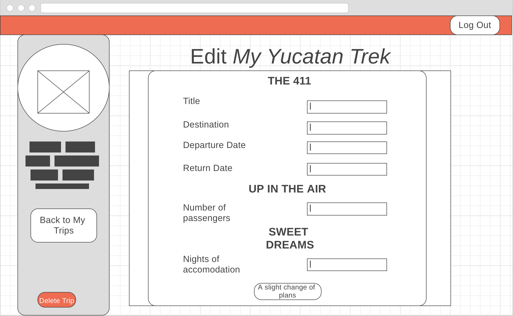

#Shoestring: Save. And see the world.

####Welcome to Shoestring, a travel app that helps you visualize your travel budget and find the lowest possible airfare and hotel room for your intended destination.

###User Stories

####As a savvy traveller, you aren't someone who cares so much about five star hotels or flying first class; you care more about the spirit of a place and spending your hard earned monies on the best tacos in Mexico City or kayaking around Halong Bay.   

####Shoestring wants to help you organize flight/hotel information rather than actually booking the trip for you. We help you visualize your time off, your budget and your greatest trip ideas. Leave the booking to Kayak or Skyscanner <3

######Let's get started!

Once on the landing page, please register for an account. Remember to include a photo!

You will be directed to your 'Trips Index', where you can start a new trip form.

This form asks for basic trip information:
Title
Origin
Destination
Budget - this can include things beyond airfare and accommodations calculates against the flight and hotel total
Money already saved- Enter any $ amount saved so far (could be $0)

The budget data will be visualized for each trip: total cost of airfare & hotel and total amount saved.

The form also asks for:
Departure date
Return date
Number of passengers
Location of hotel (Note: for our intents and purposes, we are using the Airport Hotel API from Amadeus. The airport code entered will return the hotel with the lowest rate for the request)
Check in date
Check out date

This trip container will render on a card displaying the main information headers about the trip:

-Title
-Origin/Destination
-Departure/Arrival Dates
-Budget representation

You can click on trip card to display expanded information regarding hotel and flight itineraries. You also have the option to edit and delete the trip (and user!).

##MVP
Create a Single Page Application with two or more data structures using React, Sinatra, ActiveRecord and PostgreSQL.

Our team of three created a travel app that renders information from two external API calls as well as our own API.

We utilized the Amadeus Travel sandbox API which included both an low fare finder and a hotel by airport finder.

The ability to Create, Update, Read and Destroy both User and Trip models brings this Single Page Application to full CRUD capacity.

##Wireframes
Landing/Splashpage

Index Page

Create New Trip Form

Edit Trip Form

##Forthcoming
-Calendar for date selection
- 
